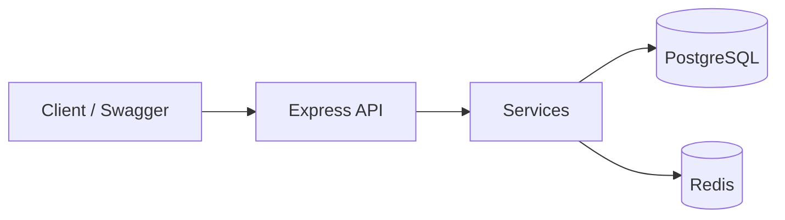

# E-Commerce Marketplace API

A production-oriented **multi-vendor marketplace backend** built with Node.js, Express, Sequelize, PostgreSQL, and Redis. Implements seller onboarding, catalog, orders, payments, inventory, settlements, and returns — similar to Daraz/Amazon-style marketplace workflows.


## Live API Documentation

After starting the stack, open the interactive Swagger UI:

### 👉 [http://localhost:3000/api-docs](http://localhost:3000/api-docs)

| Resource | Link |
| --- | --- |
| **Swagger UI** | `http://localhost:3000/api-docs` |
| **Health check** | `http://localhost:3000/api/health` |
| **Role → endpoint map** | [API_ROLES_DOCUMENTATION.md](API_ROLES_DOCUMENTATION.md) |
| **Postman collection** | [POSTMAN_COLLECTION.json](POSTMAN_COLLECTION.json) |
| **Architecture deep-dive** | [docs/ARCHITECTURE.md](docs/ARCHITECTURE.md) |

### How to try an authenticated endpoint in Swagger

1. Call `POST /api/auth/register` then `POST /api/auth/login`
2. Copy the returned `token`
3. Click **Authorize** in Swagger and paste: `Bearer <token>`
4. Execute protected endpoints (orders, seller products, inventory, etc.)

> Tip: Keep Swagger open while exploring — it is the fastest way for reviewers to understand the API surface without reading every route file.

## Key Features

- **Multi-vendor architecture** — seller onboarding, shop management, staff (sub-user) permissions
- **Advanced product catalog** — categories, brands, variants, attributes, images
- **Marketing & campaigns** — time-bound campaigns with product-level discount overrides
- **Financial system** — wallets, refunds, transaction history, seller settlements
- **Customer engagement** — product Q&A, shop following, verified-purchase reviews
- **Order lifecycle** — inventory tracking, shipments/events, returns
- **Security & audit** — JWT RBAC + admin activity logging
- **Redis performance layer** — catalog caching + API/auth rate limiting
- **CI/CD** — GitHub Actions lint → test (Postgres/Redis) → Docker build

## Tech Stack

| Layer | Technology |
| --- | --- |
| Runtime | Node.js |
| Framework | Express.js |
| ORM | Sequelize |
| Database | PostgreSQL |
| Cache & rate limiting | Redis (`ioredis`) |
| Auth | JWT (RBAC) |
| Docs | Swagger UI (OpenAPI 3) |
| Containers | Docker, Docker Compose |
| Testing | Jest, Supertest |
| CI | GitHub Actions |

## Architecture Overview

This is intentionally a **well-structured monolith** — easier to ship and review than premature microservices, while still separating concerns clearly.

```text
                   ┌──────────────┐
                   │    Client    │
                   └──────┬───────┘
                          │
                   ┌──────▼───────┐
                   │   REST API   │
                   │ Express+JWT  │
                   └──────┬───────┘
                          │
              ┌───────────▼───────────┐
              │      Services         │
              ├───────────────────────┤
              │ Auth / Users          │
              │ Products              │
              │ Orders                │
              │ Payments              │
              │ Inventory             │
              │ Sellers               │
              └───────────┬───────────┘
                          │
             ┌────────────┼────────────┐
             ▼            ▼            ▼
        PostgreSQL      Redis       Cloudinary
```



Full notes and design decisions: **[docs/ARCHITECTURE.md](docs/ARCHITECTURE.md)**

### Why Redis is used

Redis solves concrete marketplace bottlenecks (not added for buzzwords):

1. **Product & category caching** — hot public catalog reads
2. **Write-time invalidation** — version bump on product/category mutations
3. **Auth & API rate limiting** — brute-force / abuse protection per IP

If Redis is down, the API **fails open** and continues against PostgreSQL.

## Project Structure

```text
├── controllers/     # HTTP request/response handling
├── services/        # Business logic
├── models/          # Sequelize schema + relationships
├── middleware/      # Auth, RBAC, validation, rate limiting
├── helpers/         # Response + Redis cache helpers
├── routes/          # API route definitions + Swagger annotations
├── adapters/        # Uploads / error factories
├── config/          # App, Swagger, Redis config
├── docs/            # Architecture documentation
├── tests/           # Jest unit + integration suites
├── Dockerfile
└── docker-compose.yml
```

## Quick Start with Docker (recommended)

```bash
cp .env.example .env
docker compose up --build
```

| Service | URL / Port |
| --- | --- |
| API | http://localhost:3000 |
| **Swagger docs** | **http://localhost:3000/api-docs** |
| Health | http://localhost:3000/api/health |
| PostgreSQL | `localhost:5432` |
| Redis | `localhost:6379` |

```bash
docker compose down
# wipe volumes: docker compose down -v
```

## Local Development (API outside Docker)

```bash
npm install --legacy-peer-deps
cp .env.example .env   # set POSTGRES_HOST=localhost
npm run dev
```

## Testing

```bash
npm test                 # unit + integration
npm run test:unit        # no DB required
npm run test:integration # requires PostgreSQL
npm run lint             # JS syntax lint
```

Coverage focus: auth, product create/browse, seller permissions, orders + inventory, returns.

Integration tests skip automatically when PostgreSQL is unavailable.

## CI/CD

On every push/PR to `master`/`main`, GitHub Actions:

1. Install dependencies  
2. Lint  
3. Run tests against PostgreSQL + Redis services  
4. Build Docker image  
5. Validate Compose file  

Workflow: [`.github/workflows/ci.yml`](.github/workflows/ci.yml)

## Roles

| Role | Typical access |
| --- | --- |
| `customer` | Browse, order, wallet, returns, reviews |
| `seller` / `seller_staff` | Products, inventory, shipments, shop orders |
| `admin` | Seller approval, campaigns, settlements, return decisions |

See [API_ROLES_DOCUMENTATION.md](API_ROLES_DOCUMENTATION.md) for the full endpoint matrix.

## Contributing

Explore modules with tests and clear conventional commits (`feat:`, `fix:`, `test:`, `ci:`, `docs:`).
