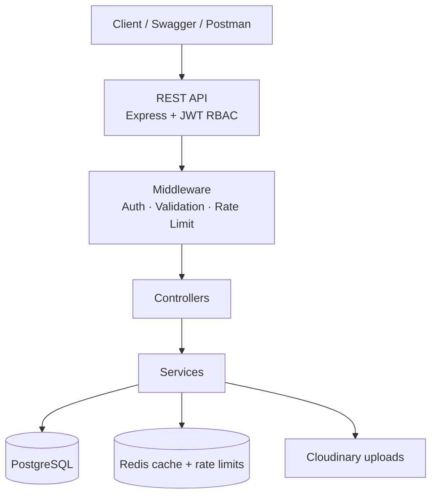

# Architecture

This API is a layered multi-vendor marketplace backend. Requests flow through Express middleware into controllers and services, with PostgreSQL as the system of record and Redis as a performance/security side-car.

## High-level diagram

```text
                        ┌──────────────────────┐
                        │   Client / Postman   │
                        │   Swagger UI Browser │
                        └──────────┬───────────┘
                                   │ HTTPS / JSON
                                   ▼
                        ┌──────────────────────┐
                        │      REST API        │
                        │  Express + Helmet    │
                        │  JWT Auth + RBAC     │
                        │  Validation          │
                        │  Rate Limiting       │
                        └──────────┬───────────┘
                                   │
                        ┌──────────▼───────────┐
                        │      Controllers     │
                        └──────────┬───────────┘
                                   │
                        ┌──────────▼───────────┐
                        │       Services       │
                        ├──────────────────────┤
                        │ Auth / Users         │
                        │ Products / Catalog   │
                        │ Orders / Inventory   │
                        │ Payments / Refunds   │
                        │ Sellers / Settlements│
                        │ Campaigns / Vouchers │
                        │ Reviews / Returns    │
                        └──────────┬───────────┘
                                   │
              ┌────────────────────┼────────────────────┐
              ▼                    ▼                    ▼
       ┌─────────────┐      ┌─────────────┐      ┌─────────────┐
       │ PostgreSQL  │      │    Redis    │      │  Cloudinary │
       │ (Sequelize) │      │ cache + RL  │      │   uploads   │
       └─────────────┘      └─────────────┘      └─────────────┘
```

## Mermaid view



## Design decisions

| Decision | Why |
| --- | --- |
| Layered monolith (routes → controllers → services → models) | Clear ownership of business rules; easy for recruiters to review without microservice complexity |
| PostgreSQL + Sequelize | Relational integrity for orders, inventory, settlements, and seller staff relationships |
| Redis for catalog cache + rate limits | Hot read paths and abuse protection without overloading Postgres |
| JWT + RBAC roles (`customer`, `seller`, `seller_staff`, `admin`) | Marketplace permission boundaries match real seller portals |
| Swagger UI at `/api-docs` | Interactive contract for frontend and QA consumers |
| Docker Compose | One-command local environment for API + Postgres + Redis |

## Request lifecycle (example: place order)

1. Client sends `POST /api/orders` with Bearer token  
2. Rate limiter checks Redis counters  
3. Auth middleware verifies JWT and role  
4. Controller delegates to `OrderService`  
5. Service validates stock, writes order + items, decrements inventory in a DB transaction  
6. Response returns order payload; catalog cache remains valid until product writes bump version keys  

## Roles at a glance

- **Customer** — browse, cart/order, wallet, returns, reviews  
- **Seller / seller_staff** — products, shipments, inventory, shop orders  
- **Admin** — approve sellers, campaigns, categories/brands, settlements, return decisions  
